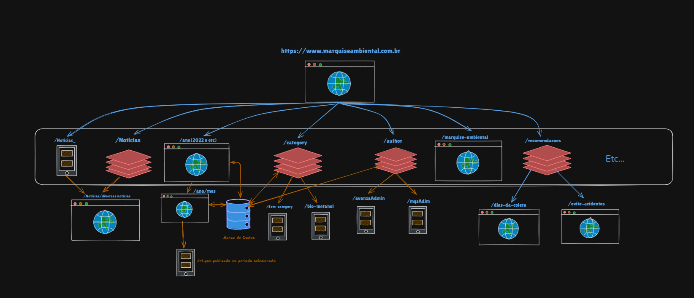

# Mapeando a Web: Um Deep Dive no domínio "marquiseambiental.com.br"

Recentemente, eu estava lendo o livro "Web Scraping com Python", de Ryan Mitchel. Em uma das seções, ele falava sobre Web Crawling — os rastreadores da web, muito usados por gigantes como o Google para indexar domínios e sites. E então pensei: "Eu posso fazer isso também!". E eu fiz. :

Há um tempo, venho observando um dos sites do Grupo Marquise(Grupo Marquise), o Marquise Ambienal (https://lnkd.in/gfR4QU8m), que é responsável pela coleta de lixo em vários lugares do Brasil e, principalmente, na minha cidade (Fortaleza, CE, através da EcoFor). Não vou me aprofundar muito nisso, afinal, essa é uma ideia para outro projeto meu.
Juntando a inspiração do livro com essa observação, pensei: "Por que não fazer um rastreamento completo desse site?"

Para essa tarefa, usei a biblioteca Scrapy, já que ela facilita bastante o trabalho de web crawling. Caso queira saber todo o processo técnico de como fiz isso, escrevi em detalhes no meu blog: https://lnkd.in/gyUByqVa.

Aqui, vou focar em apresentar a estrutura que mapeei a partir dos dados coletados (que você pode ver no diagrama acima). Tive que filtrar MUITA coisa e observar atentamente os dados para reconhecer padrões.

Estes foram os principais achados:

 - **Dois caminhos para "Notícias":** 
        Partindo da página principal, vi que havia dois caminhos principais para notícias (não sei exatamente o porquê).
            1. `/noticias_` (com underline): Levava de fato à página que continha as notícias publicadas.
            2. ``/noticias`` (sem underline): Era usado mais como um "segmento de caminho" ou "camada" para outras URLs de notícias. 
            Curiosamente, esse caminho parecia ser mais usado em links externos (acho que perceberam que ninguém pesquisa "notícias" com underline no Google KKKK).

 - **Filtros de Data:** 
        Encontrei caminhos com /ano (ex: /2022, /2023) que listavam os anos em que artigos haviam sido publicados. Descendendo dele, havia também o caminho /mes, usado para filtrar artigos de um ano e mês específicos. Ambos estavam diretamente ligados ao banco de dados para puxar os posts corretos.

 - **Filtros de Conteúdo:**
        Identifiquei dois caminhos que agiam como "camadas" para outras páginas: /category e /author. Eles basicamente filtravam as informações do banco de dados de acordo com a Categoria ou o Autor do post.

- **A Estrutura de Árvore:**
        Havia vários outros caminhos, mas selecionei os que considerei mais "importantes" para o mapa. Foquei nos que tinham "descendentes", tratando toda a estrutura de dados como um Grafo ou uma Árvore. Os outros eram, em sua maioria, "folhas" (links que terminavam ali).

E assim ficou a arquitetura que montei baseado nos dados extraidos:

Enfim, essa foi boa parte do trabalho. Foi muito legal planejar tudo e quebrar a cabeça para entender a lógica do site. (Como fã de SoulsLike, essa foi a parte boa!)
